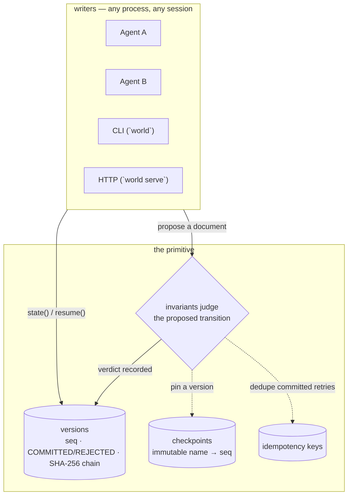

# WORLD

**WORLD is the canonical state of work for AI agents** — a named, durable
document that survives the handoff between sessions, processes, models,
and tools. Agent A finishes; Agent B loads the state and continues. The
document is versioned, every change is judged by invariants, and every
verdict — COMMITTED or REJECTED — is hash-chained evidence.

[](https://github.com/RosarioM123/world-workstate-infrastructure/actions/workflows/ci.yml)


**Status:** v0.1.0 primitive. Working prototype, not deployed. 247 tests
green in CI (pytest + ruff + mypy).

## Install

Not on PyPI yet — install from source. The core has zero dependencies
(stdlib only).

```bash
git clone https://github.com/RosarioM123/world-workstate-infrastructure.git
cd world-workstate-infrastructure
python -m venv .venv && source .venv/bin/activate   # Windows: .venv\Scripts\activate
pip install -e .            # the `world` primitive + `world` CLI
pip install -e ".[server]"  # optional: `world serve` HTTP API
pip install -e ".[test]"    # optional: full test suite (server + property tests)

python examples/quickstart.py   # minimal example, self-contained
python -m pytest tests/ -q      # without the extras, server tests skip cleanly
world --help
```

## Quickstart

Ten lines, under five minutes. Zero dependencies — stdlib only.

```bash
pip install -e .   # add [server] for HTTP, [test] for the suite
```

```python
from world import World

work = World("my-project")                    # create (or load — same call)
work.update({"task": "draft memo", "done": False})
work.checkpoint("end-of-day")                 # pin this version
print(work.state())                           # {'task': 'draft memo', 'done': False}
print(work.verify())                          # True — hash chain intact
```

## The handoff

The scenario WORLD exists for. Two processes, as separate as two agents
can be — no shared memory, no shared session.

**Agent A** works, records, checkpoints. Its process then exits:

```python
from world import World, InvariantViolation
from world.invariants import no_negative

work = World("research-acme", invariants=[no_negative("budget")])
work.update({
    "decision": "source 18A yield data from SEC filings only",
    "assumptions": ["yields stabilize by Q3"],
    "open_questions": ["foundry breakeven date?"],
    "budget": 4000,
}, actor="agent-a", note="phase 1 findings")

try:
    work.update({"budget": -500}, actor="agent-a")   # judged…
except InvariantViolation as e:
    print(e.seq, e.reason)                           # 2  no_negative: budget = -500
work.state()["budget"]                               # 4000 — untouched

work.checkpoint("phase-1-done")
# Agent A's process exits here. Nothing else persists.
```

**Agent B** starts later — new interpreter, new session — and continues:

```python
from world import World

work = World("research-acme")          # loads A's state from disk
print(work.version)                    # 1 — the work so far, numbered
print(work.state()["decision"])        # source 18A yield data from SEC filings only

state = work.state()
state["status"] = "phase 2 started"
work.update(state, actor="agent-b", note="picking up phase 2")

for h in work.history():               # the verdict log — how we got here
    print(h["seq"], h["status"], h["actor"], "-", h["note"])
# 1 COMMITTED agent-a - phase 1 findings
# 2 REJECTED agent-a - REJECTED: no_negative: budget = -500
# 3 COMMITTED agent-b - picking up phase 2
```

One honest detail: invariants are code, declared per handle. Agent B
judges with its own rules (or none). If every remote writer must face
the same rules, run `world serve` — the server declares invariants once
and judges all writers equally.

## Architecture



One named world is one SQLite file (`~/.world/<name>.db`, or
`$WORLD_DIR`). Handles are stateless views — every read hits the
database, so two processes sharing a name always agree. No cache to go
stale, no refresh API.

## State model

- **The document is opaque JSON.** `update()` replaces it wholesale: no
  merging, no schema, no migration. What you put in is what comes out.
- **Every proposal gets a verdict.** `COMMITTED` rows advance the state;
  `REJECTED` rows preserve the attempted document as evidence. Both are
  appended to a SHA-256 hash chain over prev-hash, seq, timestamp,
  actor, note, status, and the canonical state.
- **Checkpoints are immutable pins** (name → seq). `resume()` restores a
  checkpoint's document as a *new* version — history is append-only and
  is never rewritten.
- **Concurrency:** writers serialize on SQLite's write lock;
  `expected_version` gives optimistic concurrency (`ConflictError` on a
  stale read); `idempotency_key` makes retries safe — committed updates
  dedupe, rejections are always recorded.
- **Locks are a document convention,** not an engine feature: a `_locks`
  list of path patterns inside the document, enforced by the
  `respect_locks` invariant. Locking and unlocking are ordinary
  versioned updates, so every lock change is audited.
- **NaN, infinities, and non-JSON values are rejected** before anything
  is persisted.

### Correctness contract

The state model above is a contract the test suite enforces, not just
documentation:

- **Exactly-once proposal semantics.** Each proposal is judged, then
  appended exactly once. Writers serialize on SQLite's write lock;
  `expected_version` gives optimistic concurrency (`ConflictError` on a
  stale read) and `idempotency_key` dedupes committed retries while
  rejections are always recorded.
- **The invariant engine is the correctness boundary.** Nothing is
  persisted until the declared invariants pass. NaN, infinities, and
  non-JSON values are rejected before anything is written.
- **Tamper-evident audit trail.** Every version is SHA-256 hash-chained
  over prev-hash, seq, timestamp, actor, note, status, and the canonical
  state. `verify()` pinpoints the first bad row, and rejected proposals
  are chained too, so the trail records what was blocked and why.
- **Deterministic replay.** State rebuilds from the version log alone;
  checkpoints restore as new versions, never rewrites. Any participant
  replaying history arrives at the same state.

Boundary, stated plainly: tamper-evident, not immutable, and the
database cannot name the rule set that judged a historical version (see
Current limitations). The 247-test suite exercises each guarantee above
in CI.

## API

Five operations. Full reference: `src/world/core.py` (typed, `py.typed`
shipped). Design rationale: `docs/adr/0008-world-primitive.md`.

| Operation  | Python                                                        | CLI                                       |
|------------|---------------------------------------------------------------|-------------------------------------------|
| create     | `World("my-project")`                                         | `world init my-project`                   |
| update     | `work.update(doc, actor=, note=, expected_version=, idempotency_key=)` → seq | `world update my-project --file s.json` |
| checkpoint | `work.checkpoint("v1")` → seq                                 | `world checkpoint my-project v1`          |
| load       | `work.state()` / `state(version=)` / `state(checkpoint=)`     | `world state my-project`                  |
| resume     | `work.resume("v1")` → seq                                     | `world resume my-project v1`              |

Reads: `history(limit=)` (verdict log, oldest first), `verify()`
(hash-chain check), `version`, `checkpoints()`, `name`, `path`.
Errors: `InvariantViolation` (carries `seq` and `reason` of the recorded
rejection), `ConflictError`, `KeyError` (unknown version/checkpoint),
`ValueError` (bad name, bad JSON, duplicate checkpoint).

### Invariants

An invariant is `(old_state, new_state) -> None`; raise
`InvariantViolation` to reject. Shipped helpers in `world.invariants`:
`no_negative(*paths)`, `finite_numbers(*paths)`, `require_keys(*paths)`,
`respect_locks()` — path patterns are dot-separated with `*` wildcards
(`"totals.*"`, `"tasks.0.status"`). Anything else is a plain function
you write. Non-violation exceptions propagate uncaught and are *not*
recorded — a crashing judge is a bug, not a verdict.

### Agent handoff

The first agent-facing API on the primitive — no LLM provider dependency,
stdlib only. An agent writes its work state; a fresh agent recovers it
from the world name alone:

```python
from world import AgentState, Decision, Evidence, load_state, save_state

state = AgentState(
    objective="Draft the Q3 foundry memo",
    decisions=[Decision("Source yields from SEC filings only",
                        rationale="Filings give quarterly granularity")],
    evidence=[Evidence("Defect density improved 2x QoQ",
                       source="10-Q Q2 2026")],
    open_questions=["Foundry breakeven date?"],
    next_actions=["Build the DCF", "Run the credit stress case"],
)
save_state("research-acme", state, actor="agent-a")  # -> version seq

# later, a fresh session / process / model:
recovered = load_state("research-acme")   # the identical AgentState
```

`save_state` stores under the reserved `"handoff"` key (other document
keys are preserved); every save is a judged, hash-chained version.
`load_state` accepts a world name or a `World`, plus `version=` /
`checkpoint=` for historical handoffs, and raises `KeyError` if nothing
was ever saved. Round-trip fidelity is pinned by `tests/test_handoff.py`,
including a two-interpreter test proving no in-memory state leaks.

### CLI and HTTP

The `world` command covers every operation (`init`, `update`, `state`,
`checkpoint`, `checkpoints`, `resume`, `history`, `verify`,
`import-transcript`). `world serve my-project` (needs `pip install -e
".[server]"`) exposes the same model over HTTP (`GET /v1/state`, `POST
/v1/update`, `/v1/checkpoint`, `/v1/resume`, `GET /v1/history`,
`/v1/checkpoints`, `/v1/verify`) with an API-key gate (`WORLD_API_KEY`
→ `X-API-Key`; fail-open with a warning when unset) and per-IP write
rate limiting. Declare invariants once via `--invariants mymod:rules`.
`world import-transcript` folds a chat transcript into
`state["transcript"]`, idempotent on the transcript text.

## Experiments

The thesis is tested, not asserted. Both experiments hand the same Agent A
research output to a successor Agent B in three conditions — structured
WORLD state, conventional summary, raw transcript/journal — and blind-grade
the continuations.

Method detail (#002): conditions are blind-labeled X/Y/Z with filename
and format echoes stripped, graded by an independent evaluator against a
predeclared 14-metric answer key built from Agent A's decisions and
assumptions before grading; the mapping is revealed only after scoring.
The full design replicates on a second domain (Disney after Intel).

- **#001** (2026-09-17, Block Inc.): WORLD state won on governance —
  5/5 decisions with rationales intact, 7/7 assumptions with confidence
  levels, zero errors. Narrative formats preserved facts but lost
  decisions-as-decisions. n=1. (`docs/experiment-001-results.md`)
- **#002** (2026-09-17–23, Intel + Disney replication): WORLD-state
  continuation preserved decision governance best in both runs (Intel
  3.92 vs 3.58 vs 3.33; Disney 4.45 vs 4.09 vs 2.82, reference means),
  but the advantage is narrow, the summary came within 0.36 in the
  replication, and the WORLD continuation failed on revision history in
  both runs. Thesis partially supported, narrowly scoped.
  (`docs/experiment-002/results.md`)

Standing rule (`experiments/handoff_001.py`): report the ugly number. A
stated weakness with a results file behind it beats a suspiciously
perfect run with none.

## Current limitations

- **Tamper-evident, not immutable.** The hash chain detects edits;
  anyone holding the DB file can rewrite it. No signatures, no consensus.
- **Invariants are code, not data.** The database cannot name the rule
  set that judged a historical version. Two handles on one world can
  judge by different rules; `world serve` is the uniform-enforcement
  point for remote writers.
- **No per-actor identity.** `actor` is self-asserted. The API-key gate
  authenticates the deployment, not the writer. No RBAC.
- **Single-writer serialization.** Appends serialize on SQLite's write
  lock by design; `expected_version` is optimistic concurrency, not a
  transaction across documents.
- **Local-first.** One SQLite file per world. No replication, no sync
  protocol — multi-machine sharing is out of scope for the primitive.

## Roadmap

- Persisted invariant registry — the DB names the rules that judged
  each version (closes the code-not-data gap)
- License decision
- Retire or merge the legacy `world_engine` package (below)
- Experiment #003: adversarial handoff — conflicting successor goals,
  testing whether governance survives disagreement, not just amnesia
- Sync protocol design — only if #003 and real adoption demand it;
  explicitly not started

## Legacy: the `world_engine` demo

The repo also contains the original prototype this primitive was
distilled from: a deterministic constraint-checked ledger for a
synthetic logistics domain, with a FastAPI backend, a React landing
page, an offline client SDK (`src/world_sdk`, `docs/SDK.md`), and a
deterministic transcript importer. It is **not** the product direction —
the `world` primitive above is — but its hardening work (hash-chained
verdicts, atomic writes, idempotency, replay, locks, API-key gate, rate
limiting) is what the primitive was built from.

Pointers: `src/world_engine/` (kernel), `src/world_sdk/`,
`examples/synthetic-logistics-demo/`, `tools/bench.py`, `docs/adr/`.
The primitive's own design rationale is
`docs/adr/0008-world-primitive.md`.

## Repository layout

```
/src/world            — the primitive (this README): core, invariants,
                        CLI, HTTP server (opt-in), transcript producer
/src/world_engine     — legacy demo kernel (see above)
/src/world_sdk        — legacy offline client SDK (docs/SDK.md)
/tests                — 247 tests: primitive, kernel, SDK, API, security
/docs/adr             — architecture decision records
/docs                 — thesis, hypothesis, state model, experiments
/experiments          — handoff experiment harness + tasks
```

## Rules

- No secrets in this repo: no API keys, passwords, tokens, or `.env` files.
- This repo is the single home of the WORLD project. No new repos for it.
